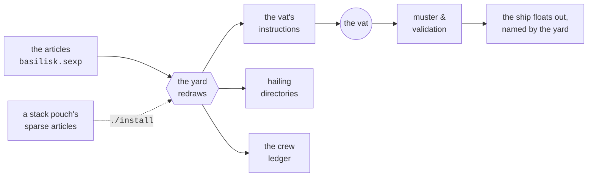
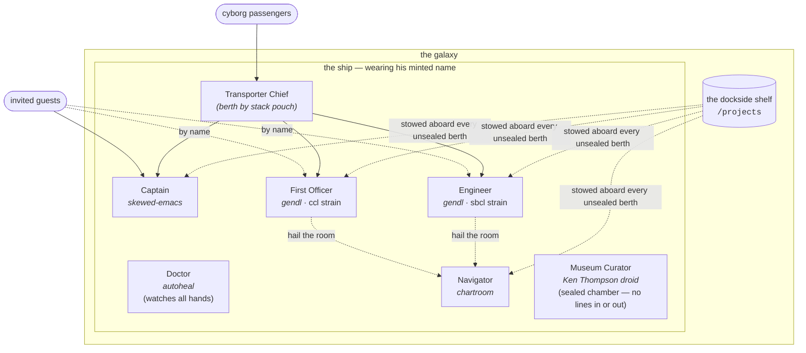

# BASILISK

A **Basilisk** is a craft raised on a hull grown in a **biological
vat**. Hulls are grown in many forms and sizes; the volkswagen or
chevrolet of the class is the **standard rig**, with facilities for a
Captain, a First Officer, an Engineer, and a Doctor. Basilisks are
capable of various hosting and transit missions, each floating in his
**galaxy** — a *he*, as Basilisks run male so far as anyone can tell.

The Shipyard bestows each ship's name at fitting-out, and he keeps it
for life. That name is the one his whole galaxy hails him and his crew
by.

The class name itself is a debt gladly worn: **Basilisk** was chosen
for this hull class in homage to the venerable Basilisk astrodynamics
computation engine, and every hull of the class repays the homage in
his own frame — see the chartroom, below.

This scroll describes the architecture which, if followed earnestly by
the vat shipwrights, will imbue upon a freshly grown bio-hull the
moral and legal right to call itself a "Basilisk-class" ship. The
operating manual — raising, standing down, coming aboard — is
[README.md](README.md).

## The yard, and the pouches

A **scroll** is a single written document. A **pouch** carries
scrolls — pouches are versatile, folding in ingenious manners to
size themselves for a few short scrolls or many long ones, and a
pouch may carry other pouches. A **scroll chest** is where you keep
your pouches; every chest has a small gecko-like **guardian** who
stays with it for life, and sports vivid memories of anything that
was ever in the chest.

Everything about a ship travels in **courier pouches**, one pouch
per idea:

- **The Basilisk yard** is the pouch this scroll travels in. It
  carries the base articles, the drawing instruments, and the vat's
  instructions for a standard rig. One clone of the yard raises one
  ship (or several, each under his own name).
  
- **A stack pouch** sits beside the yard, one per ship setup that
  deviates from the standard rig. It carries *sparse* articles — only
  the deviations and additions — and a whisper of `./install` carries
  its drawn papers into the yard. 
  
- **A fork pouch** is a class of its own: gut the articles to taste,
  name the pouch for the new class and the articles to match.  Unlike
  ships produced from stack pouches, Ships produced from basilisk fork
  pouches _cannot_ be guaranteed to comply with the Basilisk class
  designation.

From the articles, everything else is drawn:

Standing orders and other fittings that must name crew name
**postings**, and the yard resolves them against the crew ledger on
the way up — so the orders survive renames and reliefs untouched.

## The articles

Every hand aboard is listed in the articles, and only one thing must
be stated about each: the **species**. Everything else may be left for
the Yard and vatwrights to decide based on their well-worn and usually
well-advised habits.

- A hand posted to duty answers to a name derived from the posting or
  postings -- "captain", "engineer", maybe "engineer-2" in case of
  multiples.

- A species aboard with **no assigned posting** is considered a
  **stowaway**, and mustered as `stowaway-<species>` — the name
  itself is the declaration, legible at a glance. So to refine the previous rule: you need to state _two_
  things (species, posting) if you want to guarantee that crew will
  stand for that posting.

The articles are sparse on purpose: state what deviates from known
vatwright habits, and inherit the rest from those traditional values. 

## Postings and species

A **posting** says what a hand is *for*; a **species** says what he or
she or it *is*, and what, purportedly, he/she/it is skilled at doing.
A _triad_ of namings are permanently Europa-octopus-ink-tattooed onto
each crew's neck in charming Basinagari script. These namings derive
from three different sources: the *posting* (declared, or read off
the name the hand answers to), the *species* (declared in the articles), and the hand's
*personal name* to be used while onboard (minted at muster, kept for
the tour). Each crew may have a real name with a real backstory, but at
this juncture, you will have no way of knowing those. Each crew should
be considered a fresh face with a fresh name.

Droid crew are the one exception to minted names: a droid's personal
name is its serial — ordinals in order of manufacture — so the Ken
Thompson line runs kt-402, kt-403, and so on.

- Each posting lists its required qualifications in the `:postings`
  table of the articles. Requirements only — the table is not a
  catalogue of fittings.
  
- Each species carries its capabilities in its own stamped papers,
  which travel with the creature from its provenance. The Shipyard
  maintains no register of species and never presumes to adjudicate
  whether a particular creature qualifies as one, nor whether a
  particular species is actually capable of performing its assigned
  posting. 

- Where a creature hails from is **provenance** — a home planet.  In
  principle, crew from any species can come from any home planet. It
  is important for the Captain to comprehend the provenance of each
  crew member, so he can duly report any misbehavior (or especially
  helpful behavior) to the creature's home planet, where such news is
  typically received gratefully, either way.

Regarding potential gaps in qualifications of a particular species
assigned to a particular posting: at muster, each hand's papers are
read against the qualifications of every post he stands. A hand who
cannot show a required qualification draws a **grumble — and the
muster proceeds**. That is the price of an open muster: a mis-posted
hand causes no grounding and no delay. The muster officer has taken on
this policy at least for the time being, because many abilities can be
acquired aboard by arrangement and learning, an outcome which no
papers can show in advance.

## The standard rig

| posting | usual species | the watch |
|---|---|---|
| **Captain** | *skewed-emacs* | keeps the ship's console and receives and directs special visitors, especially cyborgs, personally. He typically goes down with the ship (if the ship ever goes down), and is the last to go. |
| **First Officer** | *gendl*, the `ccl` strain | bridge duty: assists the Captain, the ship's visitors, and the guests |
| **Engineer** | *gendl*, the `sbcl` strain | keeps to Engineering: reckoning, building, and drawing, for ship and passengers alike |
| **Doctor** | *autoheal* | constantly on "rounds" for the sickly and the wedged, and revives or dispatches them |
| **Navigator** | *chartroom* | keeps the chartroom and its engine: orbits, transfers, and ephemerides, reckoned for any berth that hails the room |
| **Museum Curator** | a *Ken Thompson droid* | sole keeper of the sealed museum chamber: boots the antique machine, works its console, and makes the docent's rounds |

Two further postings are on the books with **no berth in the
standard rig** — their qualifications are stated in the articles, and
a hand to stand them arrives by stack pouch:

| posting | the watch |
|---|---|
| **Transporter Chief** | Comes with a fully equipped _transporter room_. From this room, the Chief greets, screens, and directs everything and everyone transporting aboard and abroad; knows who is who and what is what and where they all belong |
| **Communications Officer** | Demands constant reports from crew members as well as from other ships and galaxies of interest; synthesizes these onto ship's main bridge viewscreen |

## The conn, the helm, and navigation

The **Captain has the conn** — authority over the ship's standing
orders, exercised by writing them. 

Two seats are empty, and named so they may someday welcome named crew
of their own:

- The **helm** goes unattended. Piloting reverts to the Captain at the
  comm or to autopilot.

- **Navigation** — deciding where the ship should go, is stood from
  ashore, by you, the proud ship's owner. No seat aboard carries it.

Yet the department is no longer without quarters, nor without a hand.
Every Basilisk-class hull grows one special compartment — **the
chartroom** — set aside expressly for a Basilisk-based charting and
navigation department, in honor of the engine the class is named for,
and a **Navigator** musters with the base complement to keep it:
orbits, transfers, and ephemerides, reckoned on the engine itself and
served to any berth that hails the room. The navigation *seat* stays
ashore all the same — the chartroom is quarters and instrument, not
the decision seat — and no proper Basilisk leaves the yard without
the full apparatus.

Although used relatively rarely, Basilisk ships come with several
propulsion mechanisms, whereby they may move around within their
galaxy, or even hop between galaxies while still in commission.

## The museum chamber

Every Basilisk-class hull also grows an **airgapped,
atmosphere-filtered museum chamber**, and no hull qualifies as a
proper Basilisk without one. The chamber houses an antique PDP-7
running a long-lived deployment of Ken Thompson's *Space Travel* —
the game whose port to that machine begat Unix, and so, in the long
run, most of what sails today. The chartroom honors the engine the
class is named for; the museum chamber honors the ancestor.

Its sole keeper is the **Museum Curator**, a droid of the Ken
Thompson line. The Curator boots the antique machine, works its
console, starts the game himself, and makes the docent's rounds,
photographing the scope for visitors. The chamber's seals are
absolute: nothing is stowed aboard from dockside, the hull takes no
writes, and no hailing frequency reaches it — visitors come in
person or not at all. Should the antique machine ever halt, the
Curator abandons the chamber, and the hull grows it afresh, exhibit
and all.

## The transporter room

**Ships that have a Transporter Room can welcome guests more productively**

The Chief's watch is knowing who is who and what is what — the
departments are poor at it precisely because they are busy about their
own work. Without a transporter room on board, guests may suddenly
appear on the bridge or in engineering with no notice, no warning, no
vetting.

## What comes aboard

Everything arriving on the pad normally falls into one of three
categories:

| aboard | what it is |
|---|---|
| **materials** | raw stock, brought aboard to be worked on |
| **goods** | processed or manufactured: the finished article, or an ingredient for the next |
| **passengers** | personnel with business here, both biological and synthetic (**cyborgs**). Cyborgs always report to the bridge before dispatching to their intended work or play site. |

Any crew may invite any guest at its discretion. Invited guests may
bypass any Transporter Room and transport directly to the vicinity of
the inviter.

## The Captain's belt

The Captain's species name (skewed-emacs) undersells its capabilities
considerably. A Captain goes about hung with instruments, of which the
"scroll authoring pad" everyone names the species after is merely the
best known:

| instrument | for |
|---|---|
| the scroll pad and its full-time attendant who keeps inkwells full, etc  | reading and writing of scrolls |
| the cyborg decoder | When cyborgs show up (either through the transporter room or directly materializing on the bridge) the cyborg decoder helps the captain interview the cyborg and decide where it belongs |
| **the glass** | Raised to look at a distant thing and see it as it actually appears, rather than as the plans claim. Not every Captain ships with one -- a lightly-fitted Captain carries no glass, and finds out the hard way |
| the public scroll pad | Allows anyone the Captain deems worthy, passengers and crew alike, to author their own scrolls  |

## Tours, watches, and death

Ships undergo relief in place, yard periods, and other maintenance
and administrative events. A hand keeps his minted name across a
watch change; a **relief in place** musters an all-new complement
onto the same hull. A tour ends one of four ways:

| cause | what happened |
|---|---|
| *relieved* | relief in place; the complement was swapped, the hull held station |
| *yard period* | ship is drydocked; crew either dead or reassigned |
| *dead* | this crew member died in the line of duty |
| *lost* | simply lost, unknown whether dead or alive |

