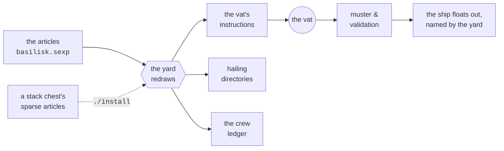
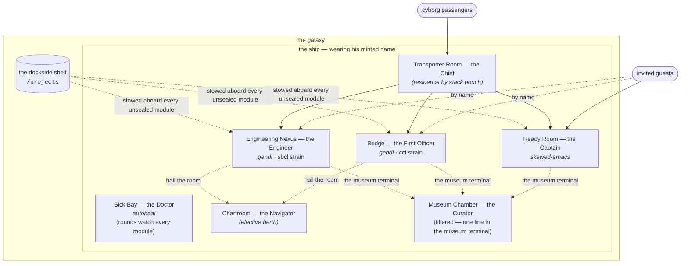

# BASILISK

A **Basilisk** is a class of space ship that is raised on a hull grown
in a **biological vat**. Hulls are grown in many forms and sizes,
while the **standard rig** flies with a Ready Room with Captain
attending, a Bridge with First Officer attending, an Engineering
Nexus with an Engineer attending, a Sick Bay whence a Doctor does
steady rounds, and a Museum Chamber that sports an antique DEC PDP-7
running Ken Thompson's original Space Travel game.

Each ship floats in a **galaxy** (he needs his galaxy to exist). Yes,
Basilisk vessels are considered "male," for reasons noöne can trace.

The Shipyard bestows each ship's name at fitting-out, and the ship
keeps this name for life. Each ship's name is unique **within his own
galaxy**. So this name is one by which his whole galaxy can hail him.

The "Basilisk" class name itself may have been chosen in homage to the
venerable Basilisk astrodynamics computation code, which indeed gets
carried by the First Officer and Ship's Engineer on every **standard
rig**.

This scroll describes the architecture which, if followed earnestly by
you, playing the role of **vatwright**, will imbue upon a freshly
grown bio-hull the moral and legal right to call itself a
"Basilisk-class" ship. The operating manual — raising, standing down,
coming aboard — is [README.md](README.md).

## The yard, scrolls, pouches, and chests

A **scroll** is a single written document. A **pouch** carries
scrolls. Pouches are versatile, folding in ingenious manners to size
themselves for a few short scrolls or many long ones, and a pouch may
carry other pouches. A **pouch chest** is where you keep your pouches;
every chest has a small gecko-like **guardian** who stays with it for
life, and sports vivid memories of anything that was ever in the
chest.

- **The Basilisk yard** is the pouch chest this scroll travels in. It
  carries the base articles, the drawing instruments, and the vat's
  instructions for a standard rig. One replicant of the yard raises
  one ship (or several, each under his own name).
  
- **Another optional pouch chest** can sit beside the yard, one per
  ship setup that deviates from the standard rig. It carries *sparse*
  articles — only the deviations and additions — and a whisper of
  `./install` carries its drawn papers into the yard.
  
- **A fork chest** is a class of its own: gut the articles to taste,
  name your new pouch chest for the new class and the articles to
  match.  Unlike ships produced from stack chests, ships produced
  from basilisk fork chests _cannot_ be guaranteed to comply with the
  Basilisk class designation.

From the articles, everything else is drawn:

Open postings are listed by **posting type**, not crew name; the yard
does its best to plug in residences of suitably capable sku during
ship raising.

## The vat hall, and the vatcycle

A Basilisk is grown in a **vat hall** — an immense growing-house of
which there are one or more in each **vat yard**. The **vat hall** is
filled with **vat stations.** A hull is seeded in a slender **embryoid
cylinder** and swells, station by station, until he fills one of the
great drum-shaped **maturation vats** at the far end of the line. The
whole run, from seeding to float-out, is a **vatcycle**.

**Vatwrights** direct the vatcycle from their rune consoles. A
vatwright knows what a ship needs in order to function: he takes his
orders from the ship's **commissioner** — the owner — and puts in what
the commissioner demands, plus whatever that entrains, plus the
required basics of the class. He works through the articles, and does
not meddle in the innards of any particular module: residences are
manufactured or grown elsewhere, and arrive at the hall pre-staffed,
their crew already at their stations.

Not every growth succeeds. An **aborted vatcycle** leaves a malformed
hull in the vat, and the hall's custom is the same soberness that
governs the muster: no panic, no grounding, no delay. The wrights hail
loudly over a hull that comes up crewless or misgrown, note the
particulars, and the line moves on.

A hull that passes muster and validation **floats out**: he rises from
his vat horizontally, belly-down, on his innate anti-gravity,
sporting the fresh name the yard just minted for him. His residential
modules are plugged in while the hull is still growing, so a Basilisk
floats out staffed and commissioned, not waiting empty at a
fitting-out pier.

In the flesh, the class runs long, thick in the belly, and
reptilian-presenting — a great yellow-eyed space dirigible of a
creature. The settled likenesses live in [artwork/](artwork/); the
scroll kept there says what to believe.

## The articles

The articles list the ship's **interior-modules** — the fitted
compartments the hull takes aboard: a ready room, a bridge, an
engineering nexus, a sick bay. One thing must be stated for each:
the **module-sku**, the catalog designation of the make and strain
of module to plug in.

These are **residential modules** — crew residences. The vatwright
outfits the *ship*; he does not hire crew. A module arrives from its
catalog **pre-staffed**: its resident crew come with it, already at
their stations, and by the work-at-home policy (below) they live
where they work. The catalogs carry two provenances and many grades:

- A residence may be **manufactured** — commodity work off a
  mainstream line, entirely respectable — or **grown organically**,
  like the hulls themselves: custom, hand-raised. The standard rig
  carries both kinds and treats them alike.

- Within a sku, residences come in **strains** — some more
  luxurious, some more efficient. A grand hull flies the luxurious
  strain of a residence for the pleasure of it; a cramped hull flies
  the efficient strain of the same residence, and its resident does
  the same work in less space.

Naming runs at two levels, and the crew level leads:

- **Crew take minted names.** Each residence's primary resident is
  minted a personal name at muster — and since a fresh muster mints
  fresh names, a relieved watch brings a fresh face with a fresh
  name into the same room. A hand wears his name with his posting
  title: "Captain Zlorg in the Ready Room says...", "Engineer
  Huxtable in Guild Workshop II calculates the following table of
  values...".

- **Rooms are known by their keepers.** A module takes no name of
  its own: speak of it possessively, by its primary resident and
  its type — "Thweed's ready room", "Huxtable's guild workshop".
  Hail the resident by name and you have hailed his room. The
  ship's lines also answer to a room's plain *type* — the bridge,
  the chartroom, the museum chamber — for callers who want the room
  and don't care who keeps it this tour.

- A module aboard whose crew stand **no assigned posting** musters
  as a presumed **stowaway residence**: its resident is minted a
  name like anyone else's, and the empty watch column is legible at
  a glance in the ledger. So, refining the one-thing rule above:
  state *two* things (module-sku, posting) if you want to guarantee
  that a module's crew will stand for that posting.

The articles are sparse on purpose: state what deviates from known
vatwright habits, and inherit the rest from those traditional values. 

## Postings, skus, and crew

A **posting** says what a module's resident crew are *for*; a
**module-sku** says what make and strain of residence they arrived
in, and what, purportedly, its crew are skilled at doing. The crew
themselves are creatures of many species; the Shipyard maintains no
register of species and never presumes to adjudicate whether a
particular creature qualifies as one, nor whether a particular
resident is actually capable of performing its assigned posting.

A _triad_ of namings are permanently Europa-octopus-ink-tattooed onto
each crew's neck in charming Basinagari script. These namings derive
from three different sources: the *posting* (declared in the
articles), the *sku* (of the residence the
hand shipped with), and the hand's *personal name* to be used while
onboard (minted at muster, kept for the tour). Each crew may have a
real name with a real backstory, but at this juncture, you will have
no way of knowing those. Each crew should be considered a fresh face
with a fresh name.

- Each posting lists its required qualifications in the `:postings`
  table of the articles. Requirements only — the table is not a
  catalogue of fittings.
  
- Each module-sku carries its capabilities in its own stamped papers,
  which travel with the residence from its catalog.

- Where a residence hails from is **provenance** — a home planet.  In
  principle, a residence of any sku can come from any home planet. It
  is important for the Captain to comprehend the provenance of each
  residence aboard, so he can duly report any misbehavior (or
  especially helpful behavior) of its crew to their home planet,
  where such news is typically received gratefully, either way.

Regarding potential gaps in qualifications of a particular residence
assigned to a particular posting: at muster, each residence's papers
are read against the qualifications of every post its crew stand. A
residence that cannot show a required qualification draws a
**grumble — and the muster proceeds**. That is the price of an open
muster: a mis-posted hand causes no grounding and no delay. The
muster officer has taken on this policy at least for the time being,
because many abilities can be acquired aboard by arrangement and
learning, an outcome which no papers can show in advance.

## The standard rig

| module | sku | resident crew | the watch |
|---|---|---|---|
| **Ready Room** | *skewed-emacs* | the **Captain** | keeps the ship's console, writes the standing orders, and receives and directs special visitors, especially cyborgs, personally. He typically goes down with the ship (if the ship ever goes down), and is the last to go |
| **Bridge** | *gendl* · `ccl` strain | the **First Officer** | runs the bridge: assists the Captain, the ship's visitors, and the guests |
| **Engineering Nexus** | *gendl* · `sbcl` strain | the **Engineer** | reckoning, building, and drawing, for ship and passengers alike |
| **Sick Bay** | *autoheal* | the **Doctor** | constantly on "rounds" for the sickly and the wedged, and revives or dispatches them |
| **Museum Chamber** | *museum-chamber* | the **Museum Curator** (a museum droid) | sole keeper of the filtered museum chamber: boots the exhibits, tends the museum terminal, and makes the docent's rounds |

Three further postings are on the books with **no berth in the
standard rig** — their qualifications are stated in the articles, and
the residence to house them arrives by stack pouch:

| module | posting | the watch |
|---|---|---|
| **Transporter Room** | **Transporter Chief** | From this fully equipped room, the Chief greets, screens, and directs everything and everyone transporting aboard and abroad; knows who is who and what is what and where they all belong |
| **Radio Shack** | **Communications Officer** | From his own shack adjoining the bridge — never on it, in the old marine custom — he demands constant reports from crew members as well as from other ships and galaxies of interest, and synthesizes these onto the ship's main bridge viewscreen |
| **Chartroom** | **Navigator** | Keeps the chartroom and its engine: orbits, transfers, and ephemerides, reckoned for any berth that hails the room. His residence runs heavy, so his berth is elective — on ships that sail without him the posting stands open on the books, and the chartroom arrives with the hand who signs on to keep it |

## Stations and quarters

A hand's station is also his quarters: the class keeps a firm
**work-at-home policy**, and the residential modules are built to
it. Every crew member lives in the module he works in — the Engineer
in his nexus, the Curator in his chamber, the Doctor in his sick bay
between rounds — and every residence ships with **full work-from-home
controls**: everything the work needs is inside the resident's own
walls, and nothing about the work assumes fittings outside them.
Hail the room and it answers with its resident; ask for a hand by
title and name and you are put through to his residence — one
address either way.

Fires burn wherever crew are at work, and the ship keeps his smoke:
read it, and it tells the tale of every fire aboard long after the
fire itself has moved on.

## The conn, the helm, and navigation

The **Captain has the conn** — authority over the ship's standing
orders, exercised by writing them. 

Two seats are empty, and named so they may someday welcome named crew
of their own:

- The **helm** goes unattended. Piloting reverts to the Captain at
  the conn or to autopilot.

- **Navigation** — deciding where the ship should go, is stood from
  ashore, by you, the proud ship's owner. No seat aboard carries it.

Yet the department is not without a place held for it. Every
Basilisk-class ship carries **the chartroom** posting on his books,
set aside expressly for a Basilisk-based charting and navigation
department, in honor of the engine the class is named for. A
**Navigator** to stand it is elective — his residence runs heavy,
and he signs on by stack pouch like the Transporter Chief, his
chartroom arriving with him. Where he musters, orbits, transfers,
and ephemerides are reckoned on the engine itself and served to any
berth that hails the room; where he doesn't, the posting stands open
on the books, as is the custom of the class with empty seats. The
navigation *seat* stays ashore either way — the chartroom is
quarters and instrument, not the decision seat.

Although used relatively rarely, Basilisk ships come with several
propulsion mechanisms, whereby they may move around within their
galaxy, or even hop between galaxies while still in commission.

## The ready room, and the bridge

The **Captain keeps to his ready room**. By the work-at-home policy
it is his station and his quarters both, and callers at any hour
find him at home there: the ship's console lives in the ready room,
the standing orders are written there, and special visitors are
received there personally.

Adjoining the ready room is the **cyborg greeting hall**. Every
cyborg aboard — whether stepping off the transporter pad or
materializing directly — presents himself in the hall, where he is
received, decoded, and directed to his work or play site under the
Captain's close personal supervision. No cyborg wanders the ship
looking for his business; the hall exists so that none needs to.

The **bridge is the First Officer's watch**. He runs it in the
classic manner of fine first officers: precise, unhurried, and
disinclined to trouble the Captain with anything the bridge can
settle itself. The Captain has the conn wherever he sits; the First
Officer has the bridge.

## The museum chamber

Every Basilisk-class hull also grows an **atmosphere-filtered museum
chamber**, and no hull qualifies as a proper Basilisk without one.
Its founding exhibit — the first, and so far the only — is an antique
PDP-7 running a long-lived deployment of *Space Travel*, Ken
Thompson's 1969 game whose port to that machine begat Unix, and so, in
the long run, most of what sails today. The chartroom honors the
solver the class is named for; the museum chamber honors the
ancestors, and keeps room for more antiques as they are acquired.

Its sole keeper is the **Museum Curator** — a museum droid, and a
professional: he boots the exhibits, works their consoles, starts
the game himself, and makes the docent's rounds, photographing the
scope for visitors. The chamber's filters are strict — nothing is
stowed aboard from dockside, and the hull takes no writes — but the
chamber is filtered, not sealed: the founding exhibit's own console
rides the ship's lines as **the museum terminal**. Hail the room and
the antique machine itself answers — one line, first come first
seated. The Doctor's rounds include the chamber: should an exhibit
halt or go dark, the hull grows the chamber afresh, exhibits and
all.

## The transporter room

**Ships that have a Transporter Room can welcome guests more productively**

The Chief's watch is knowing who is who and what is what — the
departments are poor at it precisely because they are busy about their
own work. Without a transporter room on board, guests may suddenly
appear on the bridge or in engineering with no notice, no warning, no
vetting.

## What comes aboard

Everything arriving on the pad normally falls into one of three
categories:

| aboard | what it is |
|---|---|
| **materials** | raw stock, brought aboard to be worked on |
| **goods** | processed or manufactured: the finished article, or an ingredient for the next |
| **passengers** | personnel with business here, both biological and synthetic (**cyborgs**). Cyborgs always report to the greeting hall before dispatching to their intended work or play site. |

Any crew may invite any guest at its discretion. Invited guests may
bypass any Transporter Room and transport directly to the vicinity of
the inviter.

## The Captain's belt

The ready room's sku (*skewed-emacs*) undersells what ships inside
it considerably. A Captain goes about hung with instruments, of
which the "scroll authoring pad" everyone names the sku after is
merely the best known:

| instrument | for |
|---|---|
| the scroll pad and its full-time attendant who keeps inkwells full, etc  | reading and writing of scrolls |
| the cyborg decoder | When cyborgs show up (off the transporter pad, or materializing directly in the greeting hall) the cyborg decoder helps the captain interview the cyborg and decide where it belongs |
| **the glass** | Raised to look at a distant thing and see it as it actually appears, rather than as the plans claim. Not every Captain ships with one -- a lightly-fitted Captain carries no glass, and finds out the hard way |
| the public scroll pad | Allows anyone the Captain deems worthy, passengers and crew alike, to author their own scrolls  |

## Tours, watches, and death

Ships undergo relief in place, yard periods, and other maintenance
and administrative events. A hand keeps his minted name across a
watch change; a **relief in place** musters an all-new complement
onto the same hull. A tour ends one of four ways:

| cause | what happened |
|---|---|
| *relieved* | relief in place; the complement was swapped, the hull held station |
| *yard period* | ship is drydocked; crew either dead or reassigned |
| *dead* | this crew member died in the line of duty |
| *lost* | simply lost, unknown whether dead or alive |

